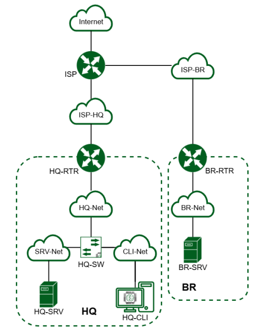
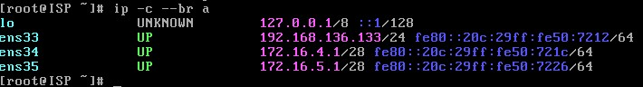
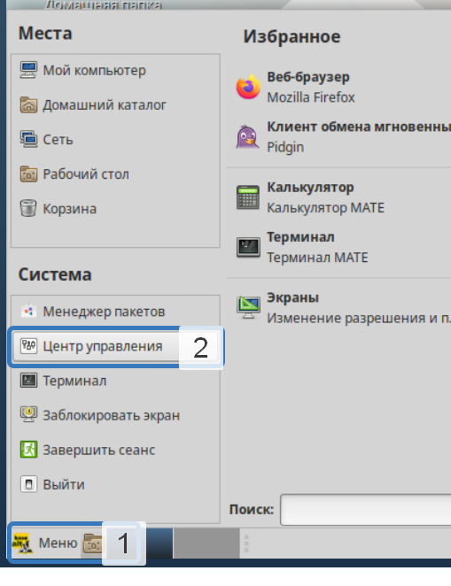
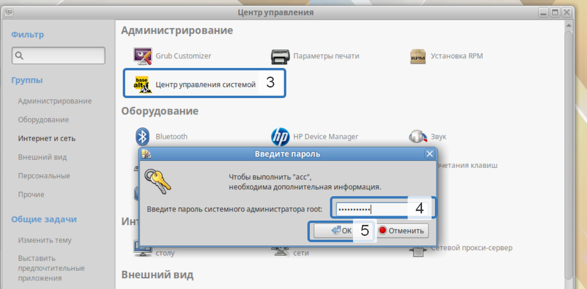
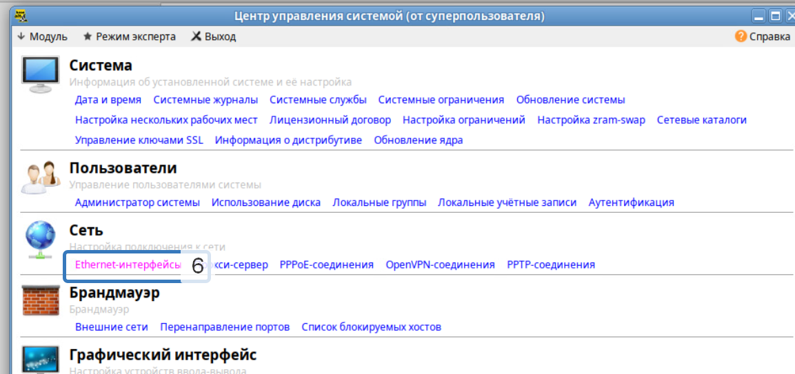
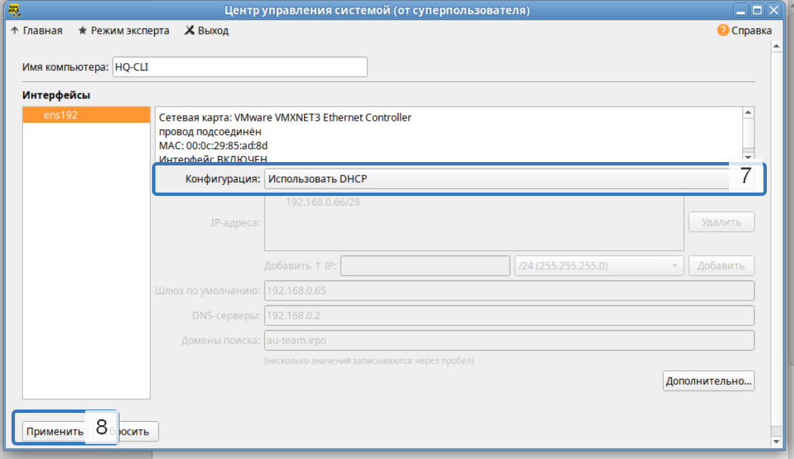
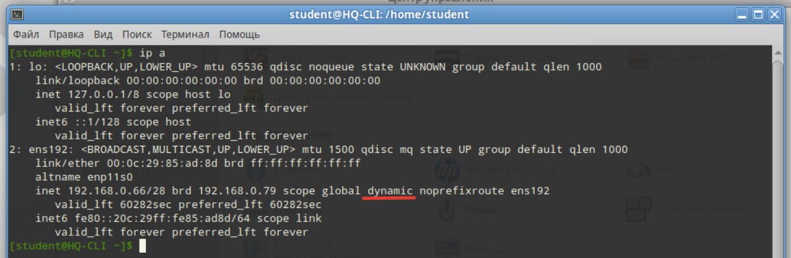
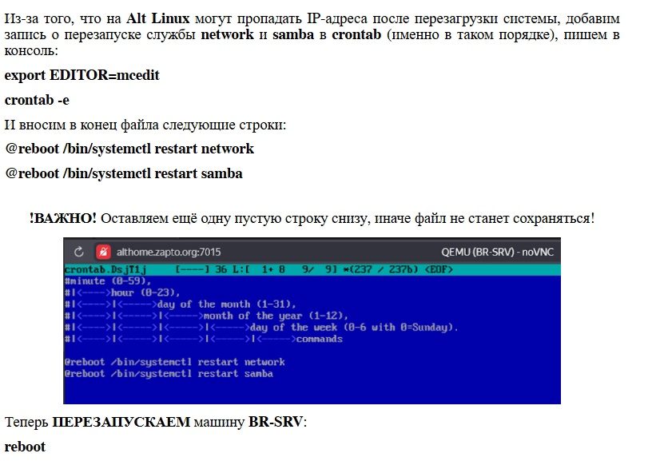
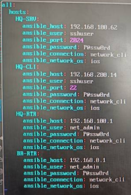

# demo2025
## 
## Модуль 1
### Распределение IP:
| Имя устройства | Интерфейс | IP          | Маска           | Шлюз        |
| -------------- | --------- | ----------  | --------------- | ----------- |
| ISP            | gi1/0/1   | DHCP        |                 |             |
|                | gi1/0/2   | 172.16.40.1  | /28 (255.255.255.240) |—|
|                | gi1/0/3   | 172.16.50.1  | /28 (255.255.255.240) |—|
| HQ-RTR         | ge0       | 172.16.40.2  | /28 (255.255.255.240) | 172.16.40.1  |      
|                | ge1.15   | 192.168.100.1 | /27 (255.255.255.224) |—|      
|                | ge1.25   | 192.168.200.1| /27 (255.255.255.224) |—|      
|                | ge1.99   | 192.168.220.1| /29 (255.255.255.248) |—|
|                | tunnel.1  | 172.16.0.1  | 	/30 (255.255.255.252) |—|      
| BR-RTR         | ge0       | 172.16.50.2  | /28 (255.255.255.240) | 172.16.50.1  |      
|                | te0       | 192.168.0.1 | /28 (255.255.255.240) |—|
|                | tunnel.1  | 172.16.0.2  | /30 (255.255.255.252) |—|
| HQ-SRV         | ens33     | 192.168.100.2 | /27 (255.255.255.224) | 192.168.100.1 |      
| HQ-CLI         | ens192    | DHCP        | /27 (255.255.255.224) | 192.168.200.1|      
| BR-SRV         | ens192    | 192.168.0.2 | /28 (255.255.255.240) | 192.168.0.1 |
### Выдача имени устройству:
```
ISP - hostnamectl set-hostname ISP; exec bash
HQ-RTR - hostname HQ-RTR.au-team.irpo
BR-RTR - hostname BR-RTR.au-team.irpo
HQ-SRV - hostnamectl set-hostname HQ-SRV.au-team.irpo; exec bash
BR-SRV - hostnamectl set-hostname BR-SRV.au-team.irpo; exec bash
HQ-CLI - hostnamectl set-hostname HQ-CLI.au-team.irpo; exec bash
```
### 1 Назначение IP:
#### ISP
Просмотр и создание директорий для интерфейсов
```
ip -c a
mkdir /etc/net/ifaces/ens**
mkdir /etc/net/ifaces/ens**
```
Создание настроек для интерфейсов
```
vim /etc/net/ifaces/ens**/options
TYPE=eth
DISABLED=no
NM_CONTROLLED=no
BOOTPROTO=static
CONFIG_IPv4=yes
выйти и сохранить изменения в vim :wq
cp /etc/net/ifaces/ens34/options /etc/net/ifaces/ens**
```
Выдача IP
```
echo 172.16.40.1/28 > /etc/net/ifaces/ens**/ipv4address
echo 172.16.50.1/28 > /etc/net/ifaces/ens**/ipv4address
```
включение forwarding, в строке net.ipv4.ip_forward поменять 0 на 1
```
vim /etc/net/sysctl.conf
```
Перезагрузка службы network
```
systemctl restart network
```
Проверка:

### 2 Настройка NAT
Обновление и установка firewalld
```

#### ISP
```
systemctl disable NetworkManager
```
Настройки интерфейсов должны быть такими:
...
NM_CONTROLLED=no
DISABLED=no
```
Установка firewalld:
```
apt-get update && apt-get -y install firewalld && systemctl enable --now firewalld
```
Правила к исходящим пакетам (в сторону провайдера):
```
firewall-cmd --permanent --zone=public --add-interface=ens33
```
Правила к входящим пакетам (к локальной сети):
```
firewall-cmd --permanent --zone=trusted --add-interface=ens34
firewall-cmd --permanent --zone=trusted --add-interface=ens35
```
Включение NAT:
```
firewall-cmd --permanent --zone=public --add-masquerade
```
Сохранение правил:
```
firewall-cmd --complete-reload
```
включим forward
```
vim /etc/net/sysctl.conf
net.ipv4.ip_forward = 1
```
#### HQ-RTR
Выбор заводской прошивки на роутере, чтоб работали порты
```
en
no boot b-image active
no boot b-image stable
no boot a-image active
no boot a-image stable
```
перезагружаем машину
```
Включение - en
Вход в конфигурационный режим - conf t
Просмотр портов - do sh port br
просмотр истории команд - do sh run
```
Создание интерфейса и назначение ему IP
```
int isp
ip address 172.16.40.14/28
ex
```
Создание интерфейсов для VLAN
```
interface HQ-SRV
 ip address 192.168.100.1/27
!
interface HQ-CLI
 ip address 192.168.200.1/27
!
interface HQ-MGMT
 ip address 192.168.220.1/29
!
```
Создание для каждого VLAN своего service-instance
```
port te0
 service-instance te0/isp
  encapsulation untagged
  connect ip interface isp
ex
ex
port te1
 service-instance te1/vlan100
  encapsulation dot1q 100
  rewrite pop 1
  connect ip interface HQ-SRV
ex
 service-instance te1/vlan200
  encapsulation dot1q 200
  rewrite pop 1
  connect ip interface HQ-CLI
ex
service-instance te1/vlan999
  encapsulation dot1q 999
  rewrite pop 1
  connect ip interface HQ-MGMT
ex
ex
ip route 0.0.0.0/0 172.16.40.1
ip name-server (который в ISP)
do wr
```
Создание nat
```
ip nat pool INTERNET 192.168.100.1-192.168.100.34,192.168.200.1-192.168.200.34
ip nat source dynamic inside-to-outside pool INTERNET overload 172.16.40.14
int isp
ip nat outside
ex
int HQ-SRV
ip nat instide
ex
int HQ-CLI
ip nat instide
ex
int HQ-MGMT
ip nat instide
ex
```
Создание GRE тоннеля
```
interface tunnel.1
 ip mtu 1400
 ip address 172.16.0.1/30
 ip tunnel 172.16.40.14 172.16.50.14 mode gre
ex
```
ospf
HQ-RTR
```
en
conf t
router ospf 1
ospf router-id 172.16.0.1
network 172.16.0.0/30 area 0
network 192.168.100.0/27 area 0
network 192.168.200.32/27 area 0
network 192.168.224.48/29 area 0
passive-interface default
no passive-interface tunnel.1
exit
interface tunnel.1
ip ospf authentication message-digest
ip ospf message-digest-key 1 md5 P@ssw0rd
ex
write memory
проверка
do sh ip ospf neighbor
do sh ip route ospf
do sh ip ospf 1
do sh ip ospf interface tunnel.1 - проверка аунтефикации
Маршрут в сторону ISP
```
dhcp
HQ-RTR
```
ip pool hq 192.168.1.34-192.168.1.34
!
dhcp-server 1
 pool hq 1
  dns 192.168.1.2
  domain-name au-team.irpo
  gateway 192.168.1.33
  mask 255.255.255.240 или так mask 28
ex
ex
int 25
dhcp-server 1
do wr
```
#### HQ-SRV
Просмотр интерфейсов
```
ip -c a
```
Создание настроек интерфейсов
```
vim /etc/net/ifaces/ens**/options
возможность делать изменения в vim клавиша I
TYPE=eth
DISABLED=no
NM_CONTROLLED=no
BOOTPROTO=static
CONFIG_IPv4=yes
выйти и сохранить изменения в vim :wq
```
Выдача DNS
```
vim /etc/resolv.conf
возможность делать изменения в vim клавиша I
nameserver "DNS от ISP который в /etc/resolv.conf"
выйти и сохранить изменения в vim :wq
```
Выдача IP
```
echo 192.168.1.2/27 > /etc/net/ifaces/ens**/ipv4address
```
Выдача шлюза
```
echo default via 192.168.1.1 > /etc/net/ifaces/ens**/ipv4route
```
включение forwarding, в строке net.ipv4.ip_forward поменять 0 на 1
```
vim /etc/net/sysctl.conf
```
Перезагрузка службы network
```
systemctl restart network
```
#### BR-RTR
Выбор заводской прошивки на роутере, чтоб работали порты
```
en
no boot b-image active
no boot b-image stable
no boot a-image active
no boot a-image stable
перезагружаем машину
```
```
Включение - en
Вход в конфигурационный режим - conf t
Просмотр портов - do sh port br
```
Создание интерфейса и назначение ему IP
```
int isp
ip address 172.16.50.14/28
ex
int lan
ip address 192.168.2.1/28
ex
```
Привязка созданных интерфейсов к портам
```
port te0
service-instance te0/isp
encapsulation untagged
connect ip interface isp
ex
ex
port te1
service-instance te1/lan
encapsulation untagged
connect ip interface lan
ex
ex
ip route 0.0.0.0/0 172.16.50.1
ip nameserver

```
Создание nat
```
ip nat pool INTERNET 192.168.2.1-192.168.2.30
ip nat source dynamic inside-to-outside pool INTERNET overload 172.16.50.14
int isp
ip nat outside
ex
int lan
ip nat instide
ex
```
Создание GRE тоннеля
```
interface tunnel.1
 ip mtu 1400
 ip address 172.16.2.2/30
 ip tunnel 172.16.50.14 172.16.40.14 mode gre
 ```
 BR-RTR OSPF
```
en
conf t
router ospf 1
ospf router-id 172.16.0.2
network 172.16.0.0/30 area 0
network 192.168.2.0/28 area 0
passive-interface default
no passive-interface tunnel.1
exit
interface tunnel.1
ip ospf authentication message-digest
ip ospf message-digest-key 1 md5 P@ssw0rd
ex
write memory
проверка
do sh ip ospf neighbor
do sh ip route ospf
do sh ip ospf 1
do sh ip ospf interface tunnel.1 - проверка аунтефикации
```
Маршрут в сторону ISP
```
ip route 0.0.0.0/0 172.16.50.1
do wr
```
#### BR-SRV
Просмотр интерфейсов
```
ip -c a
```
Создание настроек интерфейсов
```
vim /etc/net/ifaces/ens**/options
возможность делать изменения в vim клавиша I
TYPE=eth
DISABLED=no
NM_CONTROLLED=no
BOOTPROTO=static
CONFIG_IPv4=yes
выйти и сохранить изменения в vim :wq
```
Выдача DNS
```
vim /etc/resolv.conf
возможность делать изменения в vim клавиша I
nameserver "DNS от ISP который в /etc/resolv.conf"
выйти и сохранить изменения в vim :wq
```
Выдача IP
```
echo 192.168.2.2/28 > /etc/net/ifaces/ens**/ipv4address
```
Выдача шлюза
```
echo default via 192.168.2.1 > /etc/net/ifaces/ens**/ipv4route
```
включение forwarding, в строке net.ipv4.ip_forward поменять 0 на 1
```
vim /etc/net/sysctl.conf
```
Перезагрузка службы network
```
systemctl restart network
```
Проверка, должен пинговаться DNS от ISP:
```
do ping 'DNS от ISP'
Прекратить пинговать сочетание клавиш Ctrl+C
```
### 3 Создание локальных учетных записей
#### HQ-SRV и BR-SRV
```
useradd -m -u 1010 sshuser
passwd sshuser
usermod -aG wheel sshuser
echo "sshuser ALL=(ALL) NOPASSWD: ALL" >> /etc/sudoers
sshuser ALL=(ALL) NOPASSWD:ALL
sudo -i
```
Проверка
```
su - sshuser
sudo whoami
```
#### HQ-RTR и BR-RTR
```
conf t
username net_admin
password P@ssw0rd
role admin
do wr
```
### 4 Настройка SSH на HQ-SRV и BR-SRV
Делаем бэкап конфига:
```
cp /etc/openssh/sshd_config /etc/openssh/sshd_config.bak
```
Редактируем файл конфигурации SSH
```
vim /etc/openssh/sshd_config
```
Изменяем следующие параметры, раскомменчиваем, если параметр не находится то добавляем
```
Port 3010
MaxAuthTries 2
Banner /etc/openssh/banner
AllowUsers sshuser
```
Создаем файл с баннером
```
vim /etc/openssh/banner
```
```
WARNING!!!!

AUTHORIZED ACCESS ONLY!!!!
```
Перезагружаем SSH
```
systemctl restart sshd
```
```
Проверка:
```
do sh ip ospf neighbor 
do sh ip ospf interface brief
do sh ip route
```
```
#### HQ-CLI




Если сработало то в ip -c a будет так

```
### 7 настройка днс
#### HQ-SRV
```

Для начала необходимо отключить несовместимую службу bind если она есть, командой
```
systemctl disable --now bind
```
Для работы DNS есть служба dnsmasq (она же и для DHCP)
Установим её на наш сервер HQ-SRV (если есть, как у нас, то переходите к следующему шагу).
Ещё нам нужно добавить в resolv.conf сервер Google, иначе мы не сможем обновить репозитории, поэтому идём его редактировать следующей командой:
```
mcedit /etc/resolv.conf
```
И добавляем следующую строку в него:
```
nameserver 8.8.8.8
```
Обновим пакеты и установим её командами:
```
apt-get update
```
apt-get install dnsmasq (Установка пакета dnsmasq)
```
systemctl enable --now dnsmasq (Добавление службы в автозапуск)

```


```
Проверим её состояние перед работой:

```
systemctl status dnsmasq
```

```

Затем откроем файл для редактирования конфигурации нашего DNS-сервера:
```
mcedit /etc/dnsmasq.conf
```
И добавляем в неё строки (для удобства прям с первой строки файла):
```
no-resolv (не будет использовать /etc/resolv.conf)

domain=au-team.irpo

server=8.8.8.8 (адрес общедоступного DNS-сервера)

interface=* (на каком интерфейсе будет работать служба)


address=/hq-rtr.au-team.irpo/192.168.1.1

ptr-record=1.1.168.192.in-addr.arpa,hq-rtr.au-team.irpo

cname=moodle.au-team.irpo,hq-rtr.au-team.irpo

cname=wiki.au-team.irpo,hq-rtr.au-team.irpo


address=/br-rtr.au-team.irpo/192.168.2.1


address=/hq-srv.au-team.irpo/192.168.1.2

ptr-record=2.1.168.192.in-addr.arpa,hq-srv.au-team.irpo


address=/hq-cli.au-team.irpo/192.168.1.34 (Смотрите адрес на HQ-CLI, т.к он выдаётся по DHCP)

ptr-record=2.2.168.192.in-addr.arpa,hq-cli.au-team.irpo


address=/br-srv.au-team.irpo/192.168.2.2
```

```
Сохраняем файл нажатием кнопки F2, а затем выход с помощью F10.

Теперь необходимо добавить строку 192.168.1.1 hq-rtr.au-team.irpo в файл /etc/hosts:
```
mcedit /etc/hosts
```

```
Сохраняем файл, выходим из редактора.Перезапускаем службу командой:

```
systemctl restart dnsmasq
```
Проверим пинг сначала с HQ-SRV на google.com и hq-rtr.au-team.irpo:
```
ping google.com

ping hq-rtr.au-team.irpo
```
Теперь проверим пинг с HQ-CLI:
```
ping google.com

ping hq-rtr.au-team.irpo
```
И проверим работу CNAME записей с HQ-CLI:
```
dig moodle.au-team.irpo
dig wiki.au-team.irpo
```
# Создание локальных учетных записей

## HQ-SRV и BR-SRV

```
useradd -m -u 1010 sshuser
passwd sshuser
```

```
nano /etc/sudoers.d/sshuser
```

```
sshuser ALL=(ALL) NOPASSWD:ALL
usermod -aG wheel sshuser
```

### Проверка:

```
su - sshuser
sudo whoami
```

## HQ-RTR (EcoRouter)

```
conf t
username net_admin
password P@ssw0rd
role admin
activate
```

## BR-RTR (Eltex - vESR)

```
configure
username net_admin
password P@ssw0rd
privilege 15
end
!
commit
confirm
!
```
# Настройка SSH на HQ-SRV и BR-SRV

Делаем на всякий случай бэкап конфига:

```
cd /etc/openssh
cp -a sshd_config sshd_config.bak
```

Редактируем файл конфигурации SSH сервера

```
nano sshd_config
```

Изменяем следующие параметры. Не забываем их раскоментировать. Если какой-то параметр не находиться, то просто добавьте его сами

```
Port 3010
MaxAuthTries 2
Banner /etc/openssh/banner
AllowUsers sshuser
```

Создаем файл с баннером

```
nano /etc/openssh/banner
```

Вставляем в него следующие содержимое

```
******************************************************
*                     WARNING!                       *
*                                                    *
*           Access only authorized users!            *
*                                                    *
*  If you not authorized user, close this session!   *
*                                                    *
******************************************************
```

Перезагружаем `SSH`

```
systemctl restart sshd
```

## Проверка


# Настройка часового пояса

## HQ-SRV, HQ-CLI, BR-SRV

Проверяем какой часовой пояс установлен

```
timedatectl status
```


Если отличается, то устанавливаем

```
timedatectl set-timezone Asia/Yekaterinburg
```

## HQ-RTR (EcoRouter)

```
conf t
ntp timezone utc+5
```
Проверяем:

```
show ntp timezone
```

## BR-RTR (Eltex)

```
configure
clock timezone gmt +5
end
commit
confirm
```

Проверяем:

```
show date
```
# Сконфигурируйте ansible на сервере BR-SRV

Делаем на всякий случай бэкап конфига:

```
apt-get update

apt-get install ansible

apt-get install -y ansible sshpass


```
Редактируем указанные строки в конфигурационном файле /etc/ansible/ansible.cfg:
```
inventory = ./inventory.yml
host_key_checking = False

```
Далее заполняем инвентарный файл /etc/ansible/inventory.yml:
```
```



```
```
Создаем файлы с переменными для всех категорий и для категории Networking:

```
cd /etc/ansible
mkdir group_vars
touch group_vars/{all.yml,Networking.yml}

```
Редактируем их:
```
ansible_ssh_user: sshuser
ansible_ssh_pass: P@ssw0rd
ansible_python_interpreter: /usr/bin/python3

```
all.yml

```
ansible_connection: network_cli
ansible_network_os: ios

```
Networking.yml

```
```
Выполняем команду для ping`а всех машин:

```
ansible -m ping all

```
hq-rtr и br-rtr

```
security none
```
